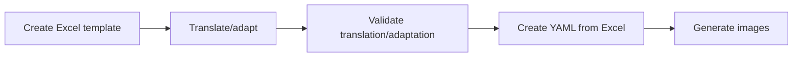

## Objective 🎯

The CAPI applications for Childcare rely on preloaded random numbers to facilitate random selection:

- **Demand-side.** Choose N images to show in the discrete choice experiment.
- **Supply side.** Choose 2 classrooms to observe.

This project creates these random numbers as tab-delimited data that can be preloaded into survey assignments.

## Installation 🔌

Before you can use the project, you need to install two things:

- `pixi`, which manages the software needed by the project
- the project environment, which includes the specific version of R and the R packages required by the project

You only need to complete these steps once--that is, install `pixi` once per device and set up the project environment once per project.

### Install `pixi` 🧚‍♂️

This project uses `pixi` to automatically install and manage the specific version of R and the R packages that it needs. You do not need to install R or any packages separately.

To install `pixi`, follow the installation instructions [here](https://pixi.prefix.dev/latest/installation/).

<!-- TODO: add specific instructions for WBG-managed devices -->

### Download the project ⬇️

To get the project code from GitHub to your device:

- Go to the project's GitHub repo
- Click the `Code` button
- Select `Download zip` and download
- Save the zip file to your computer
- Unzip the downloaded file
- Remember where you saved the unzipped project folder, since you will need this for the next step

### Set up the project environment 📦

The project environment contains the specific version of R and the R packages required by the project. Pixi will download and install these for you.

To do so:

- Open the [project directory (folder)](#use-the-project-directory) in File Explorer.
- Copy the directory path from File Explorer's address bar (e.g., `C:\Users\YourName\my-project`).
- [Open PowerShell](#open-powershell).
- [Navigate](#navigate-directories) to that [project directory](#use-the-project-directory) in PowerShell.
- Run the the following command in PowerShell: `pixi install`

For more information on any step or concept above, follow the links provided.

`pixi` will download and install R and the required R packages. The first installation may take several minutes.

When the installation is finished and the PowerShell prompt appears again, the project environment is ready to use.

You only need to run `pixi install` when setting up the project for the first time. After that, follow the project's instructions for running it.

<details>
<summary>For more a primer on using PowerShell, expand to see more here 👁️</summary>

### Open PowerShell

For all practical purposes, PowerShell is an application like any other. With that in mind, opening it involves the same steps as opening any other application or program on your computer:

- Open the Windows Start menu.
- Type `PowerShell` in the menu's search bar
- Click on PowerShell

Once open, PowerShell will display a prompt like this:

```
PS C:\Users\YourName>
```

Commands are entered after the `>` symbol. The path shown before the `>` tells you which directory PowerShell is currently using.

### Use the project directory

The project directory is, simply put, the directory where the project files from GitHub live on your device--that is, the directory [where you unzipped them](#download-the-project).

This directory is an important one. Project commands in this README should be run from the project directory.

In PowerShell, the active directory is the directory where commands are currently being run. Before running a project command, make sure the active directory is the project directory.

### Navigate directories

In File Explorer, one navigates to a directory by clicking through directories. In PowerShell, one navigates to a directory by using the `cd` ("change directory") command.

To change directories in PowerShell, one needs to compose a command of the following form: `cd "{directory_path}"`, where `"{directory_path}"` is the path to the directory (e.g., `C:\UserName\my-directory`).

To navigate directly to the directory for this project, should:

- Open File Explorer
- Navigate to the project directory in File Explorer
- Copy the directory file path from File Explorer's address bar (e.g., `C:\Users\YourName\my-project`).
- Open PowerShell
- Type `cd` , paste the path, and press `Enter` (e.g., `cd "C:\Users\UserName\my-project"`)

Note: the `"` marks around the directory file path are desirable in general and needed in particular when paths contain spaces (e.g. `C:\UserName\my path`).

### Execute commands

This simply involves writing a command and pressing `Enter`.

When you run a project command, PowerShell may display several lines of text while the task is running. This is normal. Do not close the PowerShell window while the command is running.

When the command finishes, the PowerShell prompt will appear again.

</details>

Otherwise, continue on.

## Usage 👩‍💻

### The whole game

This project supports the following workflow:



At the outset, the user creates an Excel template to translate and/or adapt the text that appears in discrete choice experiment images for the target languages of a given country. Each discrete choice experiment image consists of row labels for attributes (e.g., cost, location, etc.), column labels (i.e., Attribute, Option A, Option B), and levels of each attribute.

With this Excel template in hand, the user translates text into all relevant languages for the country and adapts context-specific context (e.g., cost levels for childcare).

Once this translation and adaptation is done, the user validates the template. This checks that all expected content is present and whether all content is properly formatted (e.g., there is one block of text surrounded by `**`).

With the validated Excel file in hand, the user converts the Excel file to the YAML format that the program needs.

Once that YAML file has been created, the user can select the YAML file and generate images for each target language contained in the file.

### List workflows

To see the available workflows and their names, type `pixi task list` as below.

``` bash
> pixi task list
Tasks that can run on this machine:
-----------------------------------
create-excel-template (by design), create-yaml-template (by design), generate-images (by design), validate-excel-template (by design)
Task                     Description
create-excel-template    Create an Excel template for translation
create-yaml-template     Create a YAML file from a Excel translation template
generate-images          Generate DCE images from YAML translations
validate-excel-template  Validate a completed Excel translation template
```

### Create an Excel template for translation

To do so:

- Run `pixi run create-excel-template`
- Provide a lowercase, two-letter country code, ideally using ISO 3166-1 alpha-2 codes (e.g., `ma` for Morocco, `gh` for Ghana, etc.)
- Provide a lowercase, two-letter language code, ideally using ISO 639-1 language codes (e.g., `fr` for French, `hi` for Hindi, etc.)
- Find the Excel file in the root of the project directory, whose name is of the form `template_{cc}_{lc1}_{lc2}.xlsx`, where `{cc}` is the country code and `{lcN}` is the Nth language code

### Validate a completed Excel translation template

To do so:

- Run `pixi run validate-excel-template`
- Choose an Excel file from the root of the project directory
- React to the results

If no problems are detected, the user will see `Template validation failed. Fix the issues and try again.`

If there are problems, they will be listed.

### Create a YAML file from a Excel translation template

To do so:

- Run `pixi run create-yaml-template`
- Choose an Excel file from the root of the project directory
- React to the results

### Generate DCE images from YAML translations

To do so:

- Run `pixi run generate-images`
- Select a YAML file, whose name is of the form `labels_new_{cc}_{lc1}_{lc2}.xlsx`, where `{cc}` is the country code and `{lcN}` is the Nth language code
- Select a language for which to generate images
- Find the images in `images/{cc}/{lc}`, where `{cc}` is the country code and `{lc}` is the language code
